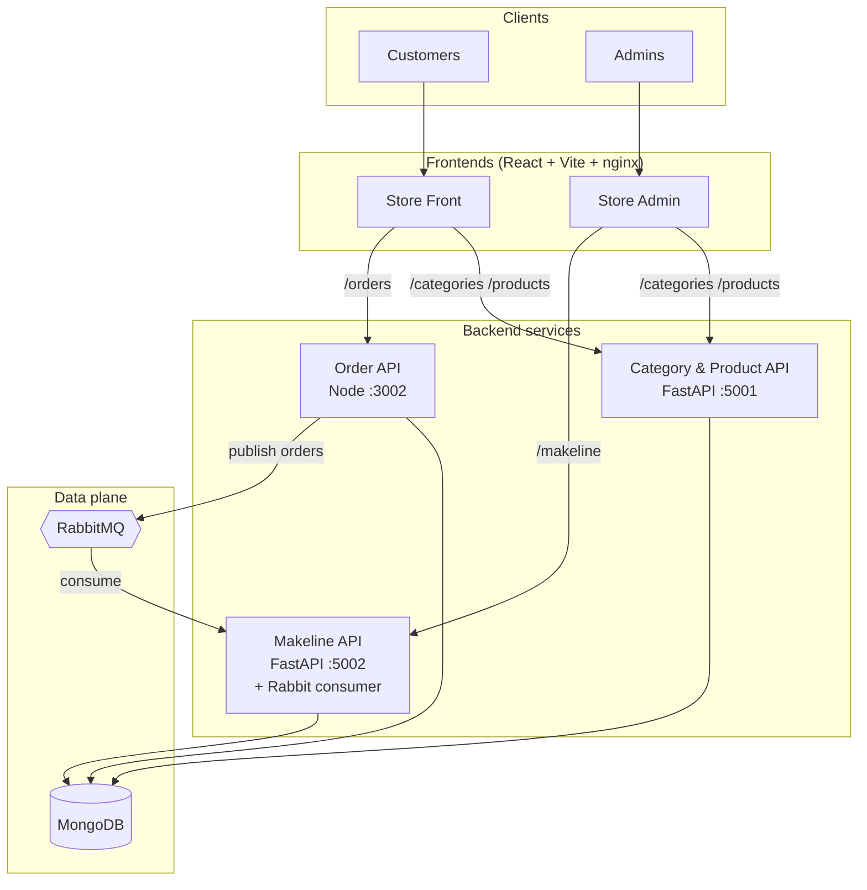

# Best Deal Store — Final Project

This repository holds **Kubernetes manifests**, **local Docker Compose** for the full stack, and **architecture** assets for the **Best Deal Store**: a simplified, cloud-native e-commerce demo deployed on **Azure Kubernetes Service (AKS)**.

---

## Architecture diagram


### Diagram sources

| Asset | Purpose |
|--------|---------|
| [**Architecture Diagram.png**](Architecture%20Diagram.png) | Static architecture figure (shown above). Re-export from Draw.io when the design changes. |
| [**Best Deal Store.drawio**](Best%20Deal%20Store.drawio) | Editable source for [diagrams.net](https://app.diagrams.net/) (Draw.io). |
| **Mermaid (below)** | Same topology in code; GitHub renders it on the repository home page. |

### Mermaid (GitHub-rendered overview)



### Data flow summary

| Flow | Path |
|------|------|
| Browse / filter products | User → Store Front → Category & Product Service → MongoDB |
| Checkout | User → Store Front → Order Service → MongoDB + RabbitMQ |
| Fulfilment / status | RabbitMQ → Makeline Service → MongoDB |
| Admin catalog | Admin → Store Admin → Category & Product Service → MongoDB |
| Admin orders / makeline | Admin → Store Admin → Makeline Service → MongoDB |

---

## Application overview

**Best Deal Store** is a small microservices storefront:

- **Store Front** — shoppers browse categories and products, manage a cart, and place orders.
- **Store Admin** — staff manage products and categories and work with orders via the makeline API.
- **Category & Product Service** — REST API for categories and products (FastAPI + Motor/MongoDB); optional startup seed for demo data.
- **Order Service** — creates orders, persists them, and publishes work to RabbitMQ.
- **Makeline Service** — HTTP API for admin workflows and a background consumer that processes queue messages and updates order state in MongoDB.
- **MongoDB** — single replica document store (StatefulSet + PVC in Kubernetes).
- **RabbitMQ** — broker between the order pipeline and the makeline consumer (non-default user in cluster config).

Frontends talk to backends through **nginx** reverse proxy paths (`/categories`, `/products`, `/orders`, `/makeline`) so the browser only hits the UI origin (same pattern in Docker Compose and AKS Services).

---

## Deployment instructions

### Prerequisites

- **Local / Compose:** [Docker Desktop](https://www.docker.com/products/docker-desktop/) (or Docker Engine) + Docker Compose v2.
- **AKS:** [Azure CLI](https://learn.microsoft.com/en-us/cli/azure/install-azure-cli) (`az`), [kubectl](https://kubernetes.io/docs/tasks/tools/), a Docker Hub account (or another registry you retag images for).

---

### Option A — Run everything locally (images from Docker Hub)

From this repository:

```bash
cd "/path/to/Best-Deal-Store-Final-Project"
export DOCKERHUB_USER=idrissop   # change if your Hub namespace differs
docker compose -f docker-compose.hub.yml pull
docker compose -f docker-compose.hub.yml up
```

| Endpoint | URL |
|----------|-----|
| Store Front | http://localhost:8080 |
| Store Admin | http://localhost:8081 |
| RabbitMQ UI | http://localhost:15672 — user / password: `bestdeal` / `bestdeal` |

Compose maps MongoDB to **`localhost:27018`** on the host (avoids clashing with a local Mongo on 27017). Optional full re-seed:

```bash
export MONGO_URL=mongodb://localhost:27018
cd "../Best-Deal-Category-and-Product-Service"
python seed_data.py --reset
```

Stop: `Ctrl+C`, then `docker compose -f docker-compose.hub.yml down` (add `-v` to drop the Mongo volume).

**Apple Silicon → AKS:** Images used on AKS must be **linux/amd64**. GitHub Actions on `ubuntu-latest` already builds amd64; for manual `docker build` on a Mac, use e.g. `docker build --platform linux/amd64 ...`.

---

### Option B — Deploy to AKS (Kubernetes)

1. **Create cluster and credentials** (example names; adjust region/count):

   ```bash
   az group create --name best-deal-rg --location canadacentral

   az aks create \
     --resource-group best-deal-rg \
     --name best-deal-aks \
     --node-count 2 \
     --enable-managed-identity \
     --generate-ssh-keys

   az aks get-credentials --resource-group best-deal-rg --name best-deal-aks
   ```

2. **Image names** — Manifests use `idrissop/best-deal-*:latest`. Replace `idrissop` with your Docker Hub user if needed:

   ```bash
   cd "Deployment Files"
   sed -i '' 's/idrissop/YOUR_DOCKERHUB_USERNAME/g' all-manifests.yaml
   ```

3. **Apply manifests** — Create the **namespace first** (other objects reference `namespace: best-deal`):

   ```bash
   kubectl apply -f "Deployment Files/00-namespace.yaml"
   kubectl apply -f "Deployment Files/configmap.yaml"
   kubectl apply -f "Deployment Files/secret.yaml"
   kubectl apply -f "Deployment Files/all-manifests.yaml"
   ```

4. **Verify:**

   ```bash
   kubectl get pods -n best-deal
   kubectl get svc -n best-deal
   ```

   Wait until **EXTERNAL-IP** is assigned for `store-front` and `store-admin` LoadBalancer Services (can take several minutes). Open `http://<EXTERNAL-IP>` for each.

   If the LB stays pending, use port-forward, e.g. `kubectl port-forward -n best-deal svc/store-front 8080:80` and open http://localhost:8080 .

5. **Troubleshooting** — Check logs if APIs or UIs misbehave:

   ```bash
   kubectl logs -n best-deal deploy/category-product-service --tail=80
   kubectl logs -n best-deal deploy/order-service --tail=80
   kubectl describe pod -n best-deal -l app=store-front
   ```

6. **Cleanup:**

   ```bash
   kubectl delete namespace best-deal
   az group delete --name best-deal-rg --yes --no-wait
   ```

---

### CI/CD (GitHub Actions)

Per microservice repo, configure **Actions secrets** (and variables where noted), for example:

| Name | Typical use |
|------|----------------|
| `DOCKER_USERNAME` / `DOCKERHUB_USERNAME` | Registry login (match your workflow) |
| `DOCKER_PASSWORD` / `DOCKERHUB_TOKEN` | Hub access token |
| `KUBE_CONFIG_DATA` | Base64 kubeconfig (keep under secret size limits; prefer **minimal** kubeconfig or `azure/login` + `aks-set-context` instead of a huge file) |
| `KUBE_NAMESPACE` | `best-deal` |
| `DEPLOYMENT_NAME` / `CONTAINER_NAME` / `DOCKER_IMAGE_NAME` | Match the **Links table** section below |

Pushes to `main` can build, push `:latest` (and/or commit SHA), then `kubectl set image` / rollout in namespace **`best-deal`**.

---

## Links table (repositories & Docker Hub)

GitHub organization used for coursework repos: **`sopn0001`**. Docker Hub images in manifests / Compose default: **`idrissop`** — change both in your fork if your accounts differ.

| Service | GitHub repository | Docker Hub image |
|---------|-------------------|------------------|
| Store Front | [Best-Deal-Store-Front](https://github.com/sopn0001/Best-Deal-Store-Front) | [idrissop/best-deal-store-front](https://hub.docker.com/r/idrissop/best-deal-store-front) |
| Store Admin | [Best-Deal-Store-Admin](https://github.com/sopn0001/Best-Deal-Store-Admin) | [idrissop/best-deal-store-admin](https://hub.docker.com/r/idrissop/best-deal-store-admin) |
| Order Service | [Best-Deal-Order-Service](https://github.com/sopn0001/Best-Deal-Order-Service) | [idrissop/best-deal-order-service](https://hub.docker.com/r/idrissop/best-deal-order-service) |
| Category & Product Service | [Best-Deal-Category-and-Product-Service](https://github.com/sopn0001/Best-Deal-Category-and-Product-Service) | [idrissop/best-deal-category-and-product-service](https://hub.docker.com/r/idrissop/best-deal-category-and-product-service) |
| Makeline Service | [Best-Deal-Makeline-Service](https://github.com/sopn0001/Best-Deal-Makeline-Service) | [idrissop/best-deal-makeline-service](https://hub.docker.com/r/idrissop/best-deal-makeline-service) |
| **This repo** (manifests & compose) | [Best-Deal-Store-Final-Project](https://github.com/sopn0001/Best-Deal-Store-Final-Project) | *No application image; uses upstream `mongo:7`, `rabbitmq:3-management` in YAML* |
